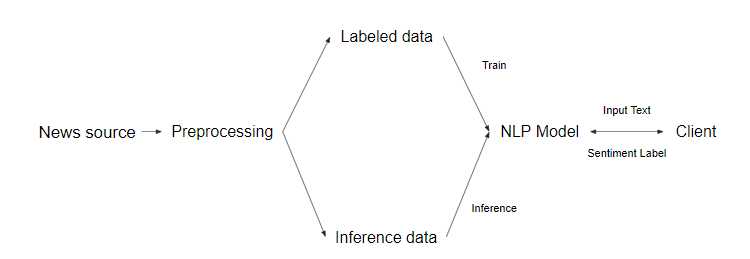
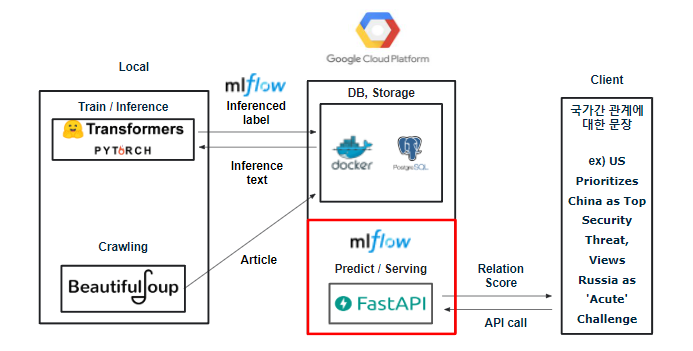

<h1> AI Engineering Infra Building Project</h1>
<h2>  프로젝트 목표  </h2>

<h3>: Deep Learing Model을 활용한 AI 엔지니어링 인프라 구축 </h3>
<br>

[![](https://img.shields.io/static/v1?label=Python&message=3.8&color=0277bd&labelColor=gray&style=flat&logo=data:image/png;base64,iVBORw0KGgoAAAANSUhEUgAAADIAAAAyCAYAAAAeP4ixAAAAAXNSR0IArs4c6QAAAARnQU1BAACxjwv8YQUAAAAJcEhZcwAADsMAAA7DAcdvqGQAAArFSURBVGhDxVl/jFVHFZ6Z9/btLtDqQkAMS8EYKdJKheDywzUbLUht/BH+KFpaMY1pSISohCJqoltSEyxGGoiQ2GhNjDECbSxtKYKJxNACW7ZYoEoKBFotBbQFdoF9b999d8bvnJm5O/fuwu5dTD377v2+851z753zZu7cuW+luEmbs3Jro2homKmNmKGUnmq0mWqMmYgTjzFCjBJGl4TBnxBlIU2XNPoc+Glj9N/BjxWUOrj/Z0ve4ZPdhA27ECpAjmj4Ihq+Fu4kYUwjziapxeC0449F77MQ8siYuEsZ+XtTp57oePz+t2wwvw2rkNbvv9BUVbUnpJEPSCmKvqHcgqEX0RfDhi/kLbCVhzY8+KyQ9vvIY8rh0M0YGcn4B7jUUi5C6wjicQynI2jMVW4YN4OQiEeygAdF0AfnmiSF/vXMlb+bwfGclruQuY/uGYtGLJMwbowxPy2KalvN1Nq0iRcLbagw0pHtkSzgmSIsGhqZTUUTr29r31skNY/lLkTG5SapZCM3xpgLUVTe9NK6r/7n1ccXd3Wuv28X7pKdSUN9w0PuY6yx4DSiKEaK6b3dpyZbYeiWu5CoUIcBbRuijVGmoaHORsgMRoeAHzQu01D2WWPBaUS9bkq1uNBkxaFb/nuktxc7e2PjnhxbjM2P5656Zlxb+7ZRs1dvfxjlzU8aN1BDWWPBaUSdbjUjY0zmOS1/ITBcy10cxRixTBf0yXKPxKxjtmAarOfAdRvKgtOIOj3RnJ7Tcheikm+LLgzAHYr9reid0SAFDiWNIkroNpYImTh0m9eGacPrEZr1Ne4QE+MBTYiNkcxzQsSBtqH2yBsWAcQBIDXr57DchTSMOHampsRHIhM1R6bWHAna4uaorN12rTmq9GArN0e9Fd4wAZzJNpj9bBGW8D6vDfxkb29XrdXZY3StOrrqRjzucv7c0KrJLmVKmd240CR2BitC68voxQUd337+nJb6AVXzw1VTvIzcw/Lf1VfkZ/9asbq1VCFt7b9pqNaaWrSWP8To+TTm9Hrb1WT+woShn+E+J51HDzj7AE1iHGS0zGmGCjELOr7zbFHEci8C9cFxtNOY918RpvYteefeo/RYhtY3tOhp2ltt2oghvQuxhUgYhQx6RtBzoQ7pljOSjy2JOc7otnTe0IpgZEHUangm4ThMIrSGwIc3JfGlgMzDI+x58/qCeTbbFTKtfVupEnWtw1keRv4IOhufL3VyQu+zkOY+xhoLTiPq9IxmmdcIWQgMw4lDPu4SgErJiei9zeZoKz88uZBbouLdyFthi/5/FuG4N3ad5uXgHNhN16L4I9OOuu7Z+CLGoFyLChoom9OyJ098FtLcx1hjwWlEnZ7RLPMaYeBjU5i+SbEB0hwPzkEbDzctvmy+Nn+8unw+moWn8x2UaPNpT4nsBD4Lae5jrLHgNKJOz2iWeY0w4wsT1wqFa3b5i/skFSea4UI0i0r1doWbexaURpb8yawT+CykuY+xxoLTiDo9o1nmNcKMT3utu+p7CmdjrbHCxvtOEqdghsPQK3hAyPkKffNJnhf8yThO6H0W0tzHWGPBaUSdntEs8xphxmeXlvHyhf1PffNqQZgZNEuF50hxj9gwXS9UwDtsgESO2oQEyQLuY6yx4DSiTs9olnmNMOOzS3n6pJFmnX7xCyWoD/kQ53Gu4x4dx5R8J977zQQo/LFIxCNZwH2MNRacRtTpGc0yrxFmfHaxLhP6eEEVHjq0ZcUFMTm+F4+O25M8zqW8AD1HDnqxXraseabsZywbTCelDiafNRZYQ7dWMS4r8DDp04eDHHPEcULv44OvEfo1CBdwf/+xWqptPrJxZVfl2PypJSGfxoNwGh/nz5NC0tmxCE3OXrMdVw/vEc5Icx/zB2KHAiLMdpvRoh1oyEWtREyRvqVW/zVXaDKO6dHdU4i639v/1JorpFWPzm/DwupJpcQUvmbq+h5JZ8ei02TL6u0xysCDkQKcwYF+B7PGAiSzC9/odw9t+MYJY9qVePO122px/HEp1WjcndKWZOtKGa377I4Nq3y8GusSjhmPl+bP4NC70RD785K7Vr92JHpaky3f234F3TEqOYADjvtEl0w7vIj8RdbUoo5NX79iziyaDu0xFNaKc4xEPhph8/qQicXsedllpCUFPsRDnYnDUO+vYRGmLyYHcMBxnxgk46bsRiVrOzaduhqfXrQEfYPlufmSkqIJrSjhBsV0jnPS4i5BaIQh51ig32QR5NNa621yvWApodtYIkRvaHFEl3sPVE+8Nl1JvQEHf4iinB/ksYWY0sjPcH9cyJkShrpDSyzig8H6Hp4j+g0ruKA/2CVZZIL+N3969cllUbFOLsc3Oi6JZfJSmNLI99y6VnO650wJQ90jE4te06aDnpzHaB5PghzFxgohE0aj5VF97sGR6JpFSWyAvARTGvmeeyTN+fZE1sL8FDKx6DTcnxqrk6cVRmgntEpyMB9gk1IHki9Nt+y5PAbOLeHJ0nkO+2khZyfjO0xiLATIxGKgoQ8ucY9UdHQYwps2mk5i8yfGhsoxL2FgYVwNnOdwUI186/bP8bEQmVjsr3XKcuNpdfTnS69h6voJlGjAA1kMNDKvp/IcDqqRz05aT7jbJej1/prW+rIsytX0QwS/IXb3lJ7D8+HPYZJFt3kttFSew0E18tnpr4ecXcJQZ5JwWhrh9miXsw6+Tj4X8o8ti6+quG45gi9Thk12W+pk7oezlOZwUI18dq6vhzyV49BxvECe1yJ+pDBn8mYMcxbxIOqzOSu3jq6J8mplxP04aDTWdSiU8mxtmKsX7l+987zorR3H8fTrSOoCKQw4hsAZXEqn47RUcX7YcOYO8eBi4xhWdrF5VyqzR8jSr+Sn9r3tiyBLFeJt7qrfjqvVqlMLUpbI537ALiqozr8t34pZq4BC+OefvgakkHR22DfV4jhRuXyVlJsx2Vsf4X4Y8PfUAQu5kekT93wUfXMc348thOy6RVgNX+VSoWW530Iy5XpHRt2VaN8H5x286IQh2fAKMVRIMLQSdI0PikhrWZ/AaywSduG9fYFqOXDICkMzvtlzW99FA6TGsGOxn8Yk8Al457DPr0n+lTGXDa8QsszFuWEevcZGmuNBLqb7S5h5dsdG74Pbk+Tg/s79n1DY/6BHsLEboCUA0gLucjD/x5h9lqgdL99b6C5+DrPTKsz6vT7H/e6by/IXUtWY9Lg1cGzD0sjEYsiDHPwdkXe9tFuuxRRAs5ASz0E/a495v3rkVnERC7VK2LA+ZGLxOkWwr/k9pu9b14J+jGuw1Mj3pUfUbXsu4k3vD2iPbV3YQKYZzuh2HMM5pJhgOlvX647WKfpwy10m1o9C/zDF0d2X6kq0iM1nuSsn0yc/P9H06h1KyBlJA8m4oQFP0OksWaR/QmIFcQXPffq9YhQKwIxuMHD1I4XZh36BhnH2UG1YN7v62J5/SVO8T5t4B9Y9dh3hG042SBG0w4XxMR/AG8EtVARe7a5hWK0tjLz2y7xFkA2rR7yZbdNKYur4r2BJtALrnilYP9G/qHlZ01dEhjNiXNKPi8L0YH8BM9iBqogfq9/ZeZImAMrKazdViDf9zzmN4t1SM+6dCeifTxhl5qKxkzF+xqLdIzFo6F9mmF5lFxr/Di76BnryoFbRqWKhdFbO3H8eX8SwCrAmxH8B/leG/qpXbq0AAAAASUVORK5CYII=)](https://www.python.org/)
[![](https://img.shields.io/static/v1?label=MLflow&message=1.23.1&color=2496ed&labelColor=gray&style=flat&logo=data:image/png;base64,iVBORw0KGgoAAAANSUhEUgAAAGQAAAAnCAYAAAD5Lu2WAAAAAXNSR0IArs4c6QAAAARnQU1BAACxjwv8YQUAAAAJcEhZcwAAFiUAABYlAUlSJPAAAAnGSURBVGhD7ZoLcFRnFcfPuTcJr7SEJLxJwss+GPqwlBbSCoLUztQ6asc60xlbq6LYkDT4wHaUNoOPVim1QkKUWmxnqNridESdcWpHApT6aKmV0fRFa0gChPAuzYOUZO/xf7777d67m+yy1RmzG/jNnNxz7t777b3f+c75vvNt6DznOU8K2B6zi40Hi6k3cgOTXEIiecJ0giLcQNVlf7dXZC3Z5ZCa7TlcPH0VMd8La5h/0keEaqiq9DvWzFoce8x8RJiLZ2yCM2pgxTnD4Mp2q2U12eOQutY7EM93WAtIH2Qr0tU9IrKKDne8aD/IarIjZd26xeWF176Fx53mn5DTQvJxqpy6zbeHDtkRIQvLLwucYeaLNUPRGUqWpKzIfKsApCo3r94a/alpzKNH9hUYWbf3Qns2axgsh9wD+ZsVXTGlhIWutqrSRBUTj1i9P0X5KzjXPWnEGb7Vns0aBsshmn6utRJLRUlhvs5qCBBKWWswO9qmARO+OjyryPyUVd8yBpPGDGvBH/KKVftTIw7C6UPWApJ1K6/BWmX9FLLMV+lRSFQn2rD/Fva8y60FeBye8i5raP76FXm011oG4Y61VDm7k358sJTdvmaEib5Xn+S6E2nZ5GP+VdlBxjmEa1sa0KGLrHl2hA5JZclk3CPGmSLP2PMtOD/NnM8iMixlIeunM6eEYXo+2umIrHnmnML0UrY5Q0kWISWQUb5KbZB3IXMgH4EUQpohv4UcgkSZCrkZMgWi1z8P+TNkoE5JnrLW7fsgOY5rdAe5x6Pf4SknGFvkD2hMt07CtFFVmT4jcV3rCziYBYCIt5Kqpq5VPcysxsa88Z0TPowXn4/WC8iTE5Tj7urrLHhh5yJG9Z/AFnGpvfkD1iK6gNrp89PesVZAfct06ssT8rojlH/hSVo6tsN+EhC+prfjOA0ffTl5zhGExWnKQZq9q/RgMof8EfJRX6UvQ5ZAboWErz8N+QpkM2QV5H5IDiSMtqP3JT5ccoeEWXfsQna7juNrTbt4k2+iIHzIfJbI4/uGc6dzDFFhBpJIpJyqpv3VfGZZvPvYDZh/NnKoyIyCYnOvuO5N2+cW/Nue8tFncLrRLuWqOaCjN7QuRCzu8A0B9D0MEu2PgPq2ORzp3Y3nY7zIKXFlGo5zqYd3UR4vQ3iPpMqyB9JJWToiPwNJdN4IyM8gP4LoLmuiM5QbIT/31f8CtwuTu+8MQ8R5yWr96ZCLo85An5yhnlP/NLpl8YvHl7LHz8acYfqNIkY3g4trjTPEpM2AE0Wd+NvlG6YTiqzqg5Ude7LGWgA97tBMa8TgSN9K4wzFoZ9QRdlJKL2U0+OReO8gW7/uf3R2JkNaIVrAfQHyJCSahvIgKyBq/wbyRcg3IOFR9mnIJb76fnGusgoQj4b37rFGf9iN1R948Vdp5ZWxTkRkXIMRrNW9gyfthSfW90VkFuw1JjIikesb5hXWaUpB2ttB65uuMDcqq5E0SfZZS9sutppPccuncO4aa/l4CQ6pP3Ax2tB+wEG6pS9HBzHR8pLtVH3Re3R32RNUVar9l5ZDjkLmQn4IeRxyO2Q9JMwGyC0QjYaHIeWQU5AoC+zxfYEVk85bUd6mZTPCbcaBoRc4ROILQkTGDzTlICYwGiO3N8wrqt553dg3sAh4LpLfN6ehfNwrJjV5ZiGwgJ2c+LTI/LbVtO3AITWNeYi4B42uURmD4ZAg0tjr+xra8OdF5kepepL26YCk45CnIIlbFb+0R0Wjw3+oAL0+vPkXH+bpEzjkLBU6iK2whCWW2pbsOlGKg1lGI2M8s23+uKdVV7bNH7tj5+zxmpKIqovfxXc8YXSSRVR7IHhmEc0QFg7OF4++E42aCR+dUIu/upjBJTKa1r7pX7du/xQS506ja3TQMB3YSUnHIaGHiREeqT2Qdl+NA5Px/0BdYz5e7FJr4YVTVOi6icihtCjuX6xGXm4klvYQIVusOiDoVB18APOWSCwN4fx+q+IjO7ge2jOKybMTN1Zq1PUgLrSpGrPIiJFmrmLHW4F7NLWrtZkqxw/UVzHScYhGwP+fSL5O6KHnc1+2Sn94xNWxawWdUzn5LaMDpJTYji+mX7M8TkoOB8t45nyr4UZusZq2XwhhGlFUhWt0fkUH8SNUNes47GAhIXQRrWsbiwfQlajaPeI43zd6CtJxyODghid06iM+lcIhXrA9z/wyJBhEzLF064ifXpLSK9Otpm0etprq4SwxijYcGY+1q+5Ya0cfolERswwWT94w5xT9LvdMBW6O1nObafmUINKSkLEOQZeGJnRpMntVScDcEKQXCeYPxY24sPXnXvwlb6kZ3UnAovRLRhHppPdot9EVljZt2Nd5JEvPfdAK1ERrD6BQ1LSNz+g1cwRMkasQnXcbAxO+cM5Zo0PJ3AhhCi8lU+/wilxvLQ2DuBXWc+UFJ9CVZn8LTj6wcEez/w8S9YfGUW3rUqMrqjN/1lpP09dLtfD1OTpVNyijVbyulvzNTpEWyi3ZaHTFdd+0GuCbIbqroTxJlZOCtJeCzHSITtKCQs+SckIvai+D88b4BiKBOTahR4mIey8G+NJt84pv27kIo3l9yxL2evcg7XyS6lo+wbUtv0aW0x0DraLbxe39ln+nZbXZUgk61BZ4GAr30zLuNeeULveARoPRo0Wg1j3usLSiQ8lMh7gjLsUL+et2hVNU6O4ZRFL05TH5VpT222faOX9Mc8O84k20UXLR+d/F1c/i9ETc9jGkla04omgzbRwWz7mJKmYO8IskN1nFR+R1OtIUXv4TrZyoxWjiqvQXVDEh/t4UZKZDvFBBqCOuOzfphM4SrpJ1/ghN6ImcbipEDGDiDo1qg6AjZZNQ5EqqnvIPezIeDtciuJrkPlq9qP9mJFF4pdUr5CTWaClJNsFp1V3mq2bXNrEo0xTxOYjery+nlXpiR+iG5GW+SroLG0yS/q5x9EcofYG4/yDhupbH8Fe3YYDslcqyWPrqR13rAnzzJKO71IgIaTR6Kh47egF1d80lh4uRd45Qz/Hd4a2WATHfY1dzjtNNy0vq1EvGDrO+eTF6RXc28LHbRpUluvmaNskcMqggrbyGDGKLQnkKDrnN14c+mZey6powSQf1Aoqu5PXHECTjHMKc820c7JY7FqziDYn/2U2XzElZD7cW8jBSZ3wVYp9L/iXLS6+Al5JP1EOMwXVIzb7hXOy+io73YOk/JARLXd2IcNwbqWLKn+yJc4LBTVnjnAUYEtPhiJlxzhDBcpEqzjVnKIPrEI90yyP6MyocQZ2Q38MZ5VRZFmxJnEMMcsqqcaiwKp+8DhRsnkcnT7fT6tmhX97Oc55Bheg/4SFCQcRjPAUAAAAASUVORK5CYII=)](https://mlflow.org/)
[![](https://img.shields.io/static/v1?label=PostgreSQL&message=14.2&color=32668f&labelColor=gray&style=flat&logo=data:image/png;base64,iVBORw0KGgoAAAANSUhEUgAAAB4AAAAeCAYAAAA7MK6iAAAAAXNSR0IArs4c6QAAAARnQU1BAACxjwv8YQUAAAAJcEhZcwAADsMAAA7DAcdvqGQAAAUOSURBVEhL7ZZrTBRXFMfPzO7sY5Z9sbC7CCwryGJBidCGqkTjo5poimlIH35okyYmfmn7pQ3f2kaTfmrih5aUSJo0jTGWlFRs0kpbIXYtEEVtaOySghJ5CMLCsi/2vTPTe2cvuLOzSCPpl6a/7GTuOWfm/mfOPefOwv9sEgoddGb4dPCFMjo7O1nBVn1wci7cyAFvUlJUUK9TTeyvcXgW5+5PTsXYg7PBaBPFU4U88Evby4oi3nB898OFQLXAg0aphGWjVjVUX2b5fvx2369nz55Nk6nXkAl/0+Mu/30hdGnAM/0iLwDDCwLQFAXox5kKNMm9tRXR3uFxI8fzShRHMQClQgGlRQZglAqYmPNBmuPFezQqRfJog7PLWSy899bx4yEiIaIg51WohmOvd1wbmTqe4ngFFkU/IOK0q6yYGfRMsak0R2M/Bp/RQ4B/JSYK1lVYYc4XBhzGczxcCO0sLyqy7N1R+ZPb7eYzd+WsR3//oGP4gfcEmkCWCfS2ML3gByRKPHKCkTj8NbMIzzmsOEMiiVSa7huZfnnvoWPlGU8GifBsPF3lDURUxJTgtJlhGb3VRqzEkhCJJ4FVP5kmmeY0jwMRlpgiEmFvKMYKgpC3KmmaBh4v6j9gzheCmvIiYomFlLIbtAliikhEWIZOoRTJZseFUqjXipPt3GqHenToNPLEWE0FsG+nE/bUOtBYT7wA9kJdOOqf9xNTRCJcYzPMowqVlb4ClW5wJQ4PZn1gRg9QXVYEWyxPJl7FaTeLxeYLRWE5HCVeAFeJcbS1tTVATBGJ8I2+3hlXqUWSEgyqTrFiOZTq3+5NQs+AR3yAXHBBDfw5CaNT3ky5I7QqBhwGRQ8aSqpSIowaPWAzqEeJuQYl5j8zkYDExbUWkAp2ZR2zi0Ew6jQZm2A3s4vDN2/1EnON3ELizWrqqgptBNmwagb1aZxYBFnDAQTQNZacTDiLdX22Algm5hq5wrDkC1zXaxmJCqOkIZF8svT4waKoZXLBrVRo0IGaUYq23VQg7LAovsy3ZcqEm3dtmTBomBliigQjCSgrNhILoECrgnn/CrGk3B1/BHVbbaj9KGgo1195++QrN0hIgkz4Ymfn0gsuqzs7k6i3Ydrrh6oScxrvx84SM/jD+TcTXFOJZArisfh8CSucQa68W51MuLu7myuIPvqivNggSQ+X5lZ2WekPDlSy55q2lYSqSy0kIicST8HuWoevqb7KNjo6fqS77+Y73/5w3U7CIjJhzLunT/9RYVJ/hzcOjJFVJY9ut3yceDz2tWub4/aVm2OMRqUEVsOI8VyMOjWc//Fu3fsXhn9puzh41T0ycSS84F2/nbIQKs3cGdcW04RRq4zud1k69EaW9lka7n/VN3YBFRbT6DTfy63+VZoqTT+37LJfaqm3fr7PnjxhCY+fPHXqjUUSFsnTFGtQn352vjLCK0shMHOHM9irk6A9qdFq7GG/f+Dw81tnz12b7g2hwsvlzKuNr7W81HwZDVe7XMbThJ/K0NBQ00eXPbdw72ZjQGn+pLWuqbm5+TZx5WW9VG9IIBCIqxh5qh02E9/V1TVJzHV5ZmGPxxMUv1A4Z1mHQUV729vbJR+EfDyzcFtb25Jeo4wQUwTv6Xq14g4apjKe9XlmYUTUrKV6V1sOi5aYdUFFKtghOjZgM8ICG/N9eKjW6t5TbZ0/UFPYv90Qe5P2Pewn8X8d/EXA/6c28xL/eQD+Br9J50bag67GAAAAAElFTkSuQmCC)](https://www.postgresql.org/)
[![](https://img.shields.io/static/v1?label=Docker&message=20.10.14&color=2496ed&labelColor=gray&style=flat&logo=data:image/png;base64,iVBORw0KGgoAAAANSUhEUgAAACgAAAAoCAYAAACM/rhtAAAAAXNSR0IArs4c6QAAAARnQU1BAACxjwv8YQUAAAAJcEhZcwAADsMAAA7DAcdvqGQAAATjSURBVFhH7ZZ/TJVVGMfPOe+ve7m8/LwaAy4YYW7NFYVK4CaIWrZYKLZYSM3KH1trrBmt9ZewFmtzNoyaC6M1VlksNk3NAqcoaUlZzVGMVc7BiDDEgJf7vvf9cd7OuZ57Ey9c4ofQH/eznb3P93nec9/nvu9znnNAhAgRItxeILvOmE0HWp5ULbuMSZAW69h58Kn8fiZnDWLXGTOi46WjmlEUGKqGXSw0J8w6wdvNrBOEwFZs2+4PDIMHJgvNCVPW4EN1Xz5DLoXUFnlkcRCeUA2riGoEIY52cCdGVPNRqimeRL6yoWz9AJNh2dbYtiH3nqXndq1I8TJXCFO+QUUzchSfWU7HmM/Yquj4/oAe9Rnlw14jO6Dp8I1xMpsaluebLiRdHhw7evhC5+dNnZ0ic4ewYDXYOzjymIltaVg11n14tv815g5hygRtAHRSW5p/AKgCjM2AJkENImgE42RgxGM2NSyaaaYxE1zX9Iqa1l8SmRxHSA2W1J/chm3wALUdAq+punERQriaahFBjCB3SrPM9VQjG9iSxJ1WdctfoxTZwbeNamYBk8AWhL1Hns3vZTLIw3VfVZES2cMkyHTLOxQfvhIlwQxSKr0pi+SOd0pyroUkuHrvsU9sCEqp7eS5EdUwDwEId1Et8dBEiN9Hkn6FaggBjhK4N8d0q5JqSpxTqP1bNV5kkn6iFV9XFl1kMkjZ+20lV4aUZibJggOAvJggHAC+THf05gWrwZyk5ONOHv7O5LjkKJLE/5qd7m4PSRASD0f+Dh2II4M4gpq8Mv6muN+H/o1PpCeiqcnmzg/05ZKnKcwVhEwxYyS+6d4E99oX1i5XYHnj2Y2qpuezOHCJYhxJwkltm9SYibEqcCjKHyQYGCsCQtFMAt2yxkSOC25vOrbHSK0GNfn8gya2DGp7LQxMA6dg2y4gvdTjv4EgS8JHZNGccbscw57EmPbaLSuDezksrP1iv2biCqbnHR5BdWV6ypJ9W7KuMtc4EM8hntkLQpQgHJwsOQqtwWs3zPlH5ODI3WlyDZMTgmRe6GL2vEKXT6LLUflWcW7YfRstWxzTRlanxXRYSMOmvW9OTisxDvHoZzsK32NyUlANWTEukWthOiyLXMKPd7mjj5BWENIepgN5XteqzORt5A/f0v1C8ffB1Pio18krn/Jm0way4rMyiCnd8Ewfh4C6M+6I3VC9cfkQc4Ul2EmLD5zcP+jVKsiGr5NUbdL7SNOFo6RR9wg8uoQty6Po1jp2+4xwCVxHXvrizdWbsv9grikJJrjz3e+FPmvomMSh7hRP2ssJzj6rqqDACnyG3Yc6PD/0/3WJNOI4/4RpgAC0EqP4t9dkya++lJenMvd/Ytxe9On5HmfjT931GOPU+5Lin3vj8VWXWcjP0x+0P9JzffSwbuFJD5i3QnaJjtR45+6G8jXnmGtajEuQQj4xLG1oK1U0vQpD0OqJleuTt+b+XE2O9zT+RP3pBwe96sdk97nTP2ECyBZuOEW+NcEh1S3bXtASmDsTQhIM0NRpi83fnike1XylZNPPVE2ri4ewlyyUAUngRK/P2O4zMV0w9FBgihzqlXj0jYC4U1ke+Xh1Uc6f/h+aJZMmeDN7bBsNN3+3pF9RMxWvL9YiXdMpcvS0M5Qmy1dTPcZv062tCBEiRPhfAMA/LFP+N0P8j3gAAAAASUVORK5CYII=)](https://www.docker.com/)
[![](https://img.shields.io/static/v1?label=FastAPI&message=0.63.0&color=009485&labelColor=gray&style=flat&logo=data:image/png;base64,iVBORw0KGgoAAAANSUhEUgAAADIAAAAxCAYAAACYq/ofAAAAAXNSR0IArs4c6QAAAARnQU1BAACxjwv8YQUAAAAJcEhZcwAAFxEAABX9ATtpm7EAAAVESURBVGhD7ZltaBxFGMefZ++Spk1bTbBNW1FRkFiVWCGQWkQoxJeKCCUQVFRQG2OatPGlkqSHvRyaNrFGTOvFhpoPtaKYUkSpouIHIykiVCsUFdQWraA2BtuaNsmZux3/c/ekJt7t7ezegR+8H8zt/J8dduc/bzu7RwUKFChQ4L+A5ZgfBrovorhdQ2zVEKmVpOhyRMuQAkiTSL/hlsdxPErMI3TJlT9QfX0COmdyNxIOB2nZ/LVkqw2k1K2o4CIclZx1hlmX+Q6G3yA7sI82tf2SOuEP/0aUYnql5zYYeJZYrULr+4f5PC44SJOxbtoSGZOoJ/wZ6etaQkGrD7m6pCETmGz82jAcTAUywaMo8ji1hA5CeGoaPXa9sfu5agoEPoCBm6DMG8KyPkRpC9Url0gmStE76+mu2jKqvvkTGh42nj+WHM2I9qxNVkgpPYnNYZ6mRLxTVHYU6mSrTbS0ZD/19c2TqCvmRvq7VxMlDuJGiyTiATWE4XJUhBlKrafgxGByMTHAzMjunhWk7LdgYqFEzNET2eKIKG8oVU8V8zpEZcXdyNBQgAJqD0wsl4hHeC81dfwowjuK2ynavUaUI+5GRk/UkW3fIcorpyme2Cl5fyhVhEViFw0MFEkkI9mN6MnG9jZR3mGrl1pDv4vyj21XUeLMPaIykt1I8cSdqE2lKG8wn6Rg2cuickfZm5PD3IHsRhQ/hK7198xWtJ0aGydE5YMqGju+SvJpOBvpDZejS28R5Q2Lv6ai8v2i8kNyB8F3i0rD2ciCkioMj1JR5ujNoKJt6I1picyCz+H82QwpJgWyo8ixYZ2N2HSDv2GlRmh06j0R/6ANnppcjXMVc9KSqUuxKh2TUi6oq52e9s57pej2F9ECLaLMYE6QZddSU+iwRNzp34HlXb0pKjt6q1NsX0UNoVMSuYBzjzBfLDlzmA55MqFbV/EzotxhLqZYcYmoOTgbUexti6/HuWJvz5ziiXtxo2tFmRGIZ6yXsxFSf0rGDObXqbn9W1HuvLazFEM3hHkoAQOUihMnMi4MzkYs/lly7jCP43WpS5QZ4/GHMTeuEGUG0xni6bOi5uA8fPq716EF3jVcuc4hfZ9+NQQCajM9tvVzCaTQHykS6hiMLJOIGcxfUHOHfqFLw7lHihJfoh5TotzQ2/sbMVQyJGtxqsgs4naLZxMaphHJpeFspCE0isl7RFT+eKmrAjVqFeUNZR2SXBpZJjvaE1Mylc0jQetJDFcfSzufoNGJz0Slkc0IrEweQHf+Kip3oi9chus9KsobzHsoEvlLVBrZjbRE9N7oeVG5w9Nb0Rt+9m8naWFgr6iMZDeimV7wanK1yJVdXdfg9/6U8EDye5i1hR58+rxEMuJupLU1hv3TIzAzLhF/BAMhrFTGn3dmsY+a296RvCPuRjRNoW9QcgNaJy4Rb/TvwDJs14kyh63DFIw9gZzrs8zMiKap421cuAk9k+E9Iwu2zahGJ5LR96kLMJb+qck6aowYvWWaG9FsbN+HCt2Hm5jvwyxegwa9XZQZbL1PQV5HT0X+kIgr3na4M0S7V6Jyg1iBqiXijDatVPrTPTNTqFEXjcZ6sdR6Gsb+jGjC4WKqKGlAD7Wjonha54BemRR9hH1Ze3I++sC/kRn6woupqOQBXEp/cbkeyXy4poYoth0qShs7jkD7eLVOkbuRGcJhi5bOr0SlanHVGkQq0crLoTGs2ILBGCo6hnM/YQ/3FfKf0jgNU1tbbsu6kD8j/0Z/vuns1B/ULLoOv6dXKCr72Kb6A3n5z7BAgQL/S4j+BrgJoam4QNPgAAAAAElFTkSuQmCC)](https://fastapi.tiangolo.com/)


- [1. 프로젝트 소개](#1-프로젝트-소개)
   - [1.1 프로젝트 배경](#11-프로젝트-배경)
   - [1.2 프로젝트 목표](#12-프로젝트-목표)
      - [1.2.1 모델 서빙 시연 영상](#121-%EB%AA%A8%EB%8D%B8-%EC%84%9C%EB%B9%99-%EC%8B%9C%EC%97%B0-%EC%98%81%EC%83%81)
   - [1.3 프로젝트 구조](#13-프로젝트-구조)
   - [1.4 Data](#14-data)
      - [1.4.1 전처리](#141-전처리)
      - [1.4.2 Data Lifecycle](#142-Data-Lifecycle)

<br>

- [2. AI 엔지니어링?](#2-ai-%EC%97%94%EC%A7%80%EB%8B%88%EC%96%B4%EB%A7%81)
   - [2.1 AI 엔지니어링을 도입한 이유](#21-AI-엔지니어링을-도입한-이유)
   - [2.2 AI 엔지니어링 구성](#22-AI-엔지니어링-구성)

<br>

- [3. 모델링(NLP)](#3-%EB%AA%A8%EB%8D%B8%EB%A7%81nlp)
   - [3.1 모델 선택 기준](#31-모델-선택-기준)
   - [3.2 실험 결과](#32-실험-결과)

<br>

- [4. MLflow를 사용한 모델 실험 관리](#4-MLflow를-사용한-모델관리)
   - [4.1 Features](#41-Features)
   - [4.2 Usage](#42-Usage)

<br>

- [5. GCP(Google Cloud Platform)를 사용한 클라우드 기반 프로젝트 구축](#5-gcpgoogle-cloud-platform%EB%A5%BC-%EC%82%AC%EC%9A%A9%ED%95%9C-%ED%81%B4%EB%9D%BC%EC%9A%B0%EB%93%9C-%EA%B8%B0%EB%B0%98-%ED%94%84%EB%A1%9C%EC%A0%9D%ED%8A%B8-%EA%B5%AC%EC%B6%95)
   - [5.1 Google Compute Engine ( Instance -> Ubuntu )](#51-google-compute-engine--instance---ubuntu)
   - [5.2 Google Storage Bucket(저장소) & Postgresql DB](#52-google-storage-bucket%EC%A0%80%EC%9E%A5%EC%86%8C--postgresql-db)
   - [5.3 Docker Container](#53-docker-container)

<br>

- [6. Fast API를 사용한 모델 서빙](#6-Fast-API를-사용한-모델-서빙)
   - [6.1 Features](#61-Features)

<br>

- [7. 보완점](#7-보완점)
   - [7.1 Workflow Management](#71-Workflow-Management)
   - [7.2 Model](#72-Model)
   - [7.3 Serving](#73-Serving)

<br>
<br>
<br>

# 1. 프로젝트 소개

- 저희는 국제 뉴스기사 데이터와 자연어처리 모델을 활용하여 국가 간 관계를 분석해주는 AI 엔지니어링 인프라 구축 프로젝트를 진행했습니다.
- PPT 자료 : https://docs.google.com/presentation/d/1FtOoHQrAhw24eZUqTXZcXAJygSP7SJrs/edit?usp=sharing&ouid=107492295937780957856&rtpof=true&sd=true

<p align="center">

</p>
<br>

## 1.1 프로젝트 배경 
 - 국제 정치적 이슈는 우리 삶에 밀접하게 연결되어 있습니다.
 - 국제 정치적 변화에 따라 한국의 경제, 정치적 환경은 큰 영향을 받게 됩니다.
 - 주요 국가 간 관계를 지수화 하여 한국을 둘러싼 대외적인 환경 변화, 위험도 측정을 하기 위함입니다.

<br>

## 1.2 프로젝트 목표
 - 자연어처리 모델을 사용한 국제정치 데이터 분석
 - AI 엔지니어링을 통한 서비스 구축 및 자동화(CI/CD) - 데이터 수집, 모델 학습 및 서빙까지의 자동화

<br>

## 1.2.1 모델 서빙 시연 영상
<div align="center">
  <video src="https://user-images.githubusercontent.com/52950175/164151978-dddb7d14-2f99-42e4-ba1e-dc75e82bd9f1.mp4" data-canonical-src="https://user-images.githubusercontent.com/52950175/164151978-dddb7d14-2f99-42e4-ba1e-dc75e82bd9f1.mp4" controls="controls" muted="muted" style="max-height:590px;">
  </video>
</div>


<br>

## 1.3 프로젝트 구조
- 각 폴더는 <span style="color:red">**각자 다른 Repository임을 가정**</span>합니다. 


```
      Root
	│
	├── NewsModel : 수집된 뉴스기사를 전처리하고 라벨링된 자료를 기반으로 모델을 학습시켜, 학습된 모델로 새로운 기사의 감정을 예측하는 패키지
	│
	├── app       : 뉴스 기사의 문장에서 국가 간 관계를 예측해주는 서비스를 제공하는 API (모델은 NewsModel 패키지 내의 모델을 사용)
	│ 
	└── crawler   : 분석에 필요한 뉴스 기사를 수집하는 크롤러들
```

<br>

## 1.4 Data
- 분석 대상: 한국, 미국, 중국, 일본, 인도, 러시아의 언론사, 정부기관의 기사, 문서
- 기간: 2019.07.01 ~ 2022.03.22

<p align="center">
 
</p>

<br>

## 1.4.1 전처리
- 기사에서 불필요한 정보가 너무 많다.
- 중요한 문장인가? → Textrank Algorithm
- 국가에 대한 문장인가? → 문장 내, 키워드 유무를 통한 필터링
- 키워드가 의미가 있는가? → NER(Name Entity Recognization) 적용

<br>  

## 1.4.2 Data Lifecycle

<br>

<p align="center">

</p>


- 모델 학습&nbsp;: 뉴스기사 데이터를 크롤링하여 모델에 사용할 데이터를 모으고, 이를 기반으로 모델을 학습
- 관계 예측&nbsp;: 새로운 데이터를 모델에 적용하여, 국가간 관계를 예측
- API 서빙&nbsp;&nbsp;&nbsp;: 사용자가 입력한 정보로, 국가 간 관계 예측 


<br>
<br>
<br>

# 2. AI 엔지니어링?

## 2.1 AI 엔지니어링을 도입한 이유
- 데이터 수집 횟수, 모델 실험, 모델 서빙, 코드와 인프라 관리에서의 어려움

<br>

## 2.2 AI 엔지니어링 구성
- 모델 실험 관리 &nbsp;&nbsp;&nbsp;&nbsp;&nbsp;&nbsp;&nbsp;&nbsp;&nbsp;&nbsp;&nbsp;&nbsp;&nbsp;: 모델 실험 관리, 서빙 모델 관리 ( [MLflow](#4-MLflow를-사용한-모델관리) )
- Ops(Operations) &nbsp;&nbsp;&nbsp;&nbsp;&nbsp;&nbsp;&nbsp;&nbsp;&nbsp;&nbsp;: 모델 서빙, 서버 제공, 관리 ( [GCP](#5-gcpgoogle-cloud-platform%EB%A5%BC-%EC%82%AC%EC%9A%A9%ED%95%9C-%ED%81%B4%EB%9D%BC%EC%9A%B0%EB%93%9C-%EA%B8%B0%EB%B0%98-%ED%94%84%EB%A1%9C%EC%A0%9D%ED%8A%B8-%EA%B5%AC%EC%B6%95) , [GCP-Storage-Bucket](#52-google-storage-bucket%EC%A0%80%EC%9E%A5%EC%86%8C--postgresql-db) , [Fast API](#6-Fast-API를-사용한-모델-서빙) )
- 파이프라인, 자동화&nbsp;&nbsp;&nbsp;&nbsp;&nbsp;&nbsp;&nbsp;: 데이터 수집 및 확인을 위한 데이터 파이프라인 작성 가능

<br>

<p align="center">
   
</p>


<br>
<br>
<br>

# 3. 모델링(NLP)

## 3.1 모델 선택 기준
&nbsp;&nbsp;&nbsp;&nbsp; 1\) 성능&nbsp;&nbsp;&nbsp;&nbsp;&nbsp;&nbsp;&nbsp;&nbsp;&nbsp;&nbsp;&nbsp;&nbsp;&nbsp;&nbsp;&nbsp;&nbsp;&nbsp;&nbsp;&nbsp;&nbsp;&nbsp;&nbsp;&nbsp;&nbsp;&nbsp;&nbsp;&nbsp;&nbsp;&nbsp;&nbsp;&nbsp;&nbsp;&nbsp;&nbsp;&nbsp;: Accuracy, F1-Score 값이 높은 모델
<br>

&nbsp;&nbsp;&nbsp;&nbsp; 2\) 용량&nbsp;&nbsp;&nbsp;&nbsp;&nbsp;&nbsp;&nbsp;&nbsp;&nbsp;&nbsp;&nbsp;&nbsp;&nbsp;&nbsp;&nbsp;&nbsp;&nbsp;&nbsp;&nbsp;&nbsp;&nbsp;&nbsp;&nbsp;&nbsp;&nbsp;&nbsp;&nbsp;&nbsp;&nbsp;&nbsp;&nbsp;&nbsp;&nbsp;&nbsp;&nbsp;: 모델 서빙에서 서버의 메모리와 성능에 더 적은 부하를 주는 모델
<br>

&nbsp;&nbsp;&nbsp;&nbsp; 3\) 양자화 이후 성능 및 용량&nbsp;&nbsp;: 서빙을 위한 양자화 적용

<br>

## 3.2 실험 결과
- 후보 모델 <br>
&nbsp;&nbsp;&nbsp;&nbsp; 1\) Electra <br>
&nbsp;&nbsp;&nbsp;&nbsp; 2\) MobileBert

   | 모델 이름   | accuracy | F1 score | 용량   | quantization 정확도 | quantization  용량 |
   |:----------:|:--------:|:--------:|:------:|:-------------------:|:------------------:|
   | BERT       | 61 %     | 0.59     | 421 mb | 55%                 | 104mb              |
   | Electra    | 64 %     | 0.63     | 124 mb | 60%                 | 61mb               |
   | MobileBert | 70 %     | 0.67     | 94mb   | 61%                 | 31mb               |

- <span style="color:red">**현재 사용하고 있는 주요 모델은 MobileBert**</span>이며, 서빙 모델로 사용하고 있습니다.
- 모델에 대한 자세한 내용은 Pypi Link (https://pypi.org/project/newsmodel/) 에서 보실 수 있습니다.


<br>
<br>
<br>

# 4. MLflow를 사용한 모델관리

## 4.1 Features
- 학습시킨 모델들을 MLflow를 사용하여 '프로젝트(Experiment) 및 실험단위(Run)로' 저장소( [GCP-Storage Bucket](#52-google-storage-bucket%EC%A0%80%EC%9E%A5%EC%86%8C--postgresql-db) )에 관리합니다.

- MLflow를 사용하여 학습시킨 실험에 대한 정보(성능평가지표, 파라미터, 모델버전) 등은 [Postgresql DB](#52-google-storage-bucket%EC%A0%80%EC%9E%A5%EC%86%8C--postgresql-db)에 저장합니다.

- MLflow에서 등록된 모델들을 서빙하기 위해, Lifecycle을 아래의 3가지 단계로 전환 시킬 수 있습니다.

&nbsp;&nbsp;&nbsp;&nbsp;&nbsp;&nbsp;&nbsp;&nbsp;&nbsp;&nbsp;&nbsp;&nbsp;&nbsp; 1\) Staging 
<br>

&nbsp;&nbsp;&nbsp;&nbsp;&nbsp;&nbsp;&nbsp;&nbsp;&nbsp;&nbsp;&nbsp;&nbsp;&nbsp; 2\) Production 
<br>

&nbsp;&nbsp;&nbsp;&nbsp;&nbsp;&nbsp;&nbsp;&nbsp;&nbsp;&nbsp;&nbsp;&nbsp;&nbsp; 3\) Achiving
- MLflow를 통해 단계를 지정한 후, 모델을 서빙하기 위한 Tool로는 [Fast API](#6-Fast-API를-사용한-모델-서빙)를 사용했습니다.

<br>

## 4.2 Usage

- [4.1 Features](#41-Features) 에서 설명드린 기능들을 이용하기 위해서는 먼저 MLflow Server를 열어줘야 합니다.
- MLflow Server는 다음의 코드를 통해 열 수 있습니다.

   > mlflow server \\ <br>
     --backend-store-uri {사용할 DB}://username:password@host:port/database_name \\ <br>
     --default-artifact-root {각 웹서비스(GCP, AWS 등)에 맞는 온라인 스토리지 형식} \\ <br>
     --host 0.0.0.0
   
<br>
<br>
<br>

# 5. GCP(Google Cloud Platform)를 사용한 클라우드 기반 프로젝트 구축

## 5.1 Google Compute Engine ( Instance -> Ubuntu )
- 내용: 저희 프로젝트에서는 인스턴스(Ubuntu)를 사용하여 [MLflow Server 연결](#42-Usage), [Docker를 활용한 DB 생성](#53-Docker-Container), [데이터 관리](#52-google-storage-bucket%EC%A0%80%EC%9E%A5%EC%86%8C--postgresql-db) 등을 하고 있습니다.
- 사용 이유: GCE(Google Compute Engine)에서 가상 머신(VM)이 표준 이미지 또는 사용자가 만든 커스텀 이미지로부터 런칭이 가능하기 때문에 쉽게 생성하고 사용할 수 있습니다.

<br>

## 5.2 Google Storage Bucket(저장소) & Postgresql DB

- 내용: 학습시킨 모델들은 프로젝트(Experiment) 아래 실험단위(Run)로 저장소(GCP-Storage-Bucket)에, 실험에 대한 정보(성능평가지표, 파라미터, 모델버전)들은 Postgresql DB에 저장하여 관리하고 있습니다.
- 사용 이유&nbsp;: Local에 Artifacts(Model, Image, Data 파일)를 저장하게 되면, Local의 성능저하 및 보안상의 이슈 때문에 Local이 아닌 데이터 저장소를 따로 두었고 저희는 데이터 저장소로 GCP-Storage-Bucket와 Postgresql DB로 선정하였습니다.

<br>

## 5.3 Docker Container

- 내용: GCE를 통해 생성한 인스턴스(Ubuntu)에 Docker를 설치하고, Container 기술을 이용하여 [Postgresql DB](#52-google-storage-bucket%EC%A0%80%EC%9E%A5%EC%86%8C--postgresql-db)를 띄웠습니다.
- 사용 이유: 코드를 더 빨리 전달하고, 애플리케이션 운영을 표준화하고, 코드를 원활하게 이동하고, 리소스 사용률을 높여 비용을 절감할 수 있었습니다.

<br>
<br>
<br>

# 6. Fast API를 사용한 모델 서빙

## 6.1 Features
- [MLflow](#4-MLflow를-사용한-모델관리)에 저장된 모델을 이용하여 inference 결과를 제공합니다.
API Server는 inference 요청이 들어오면 데이터 검증을 하고 이후 미리 [MLflow Server](#42-Usage)와 통신하여 로드된 모델을 통해 요청사항을 처리하여 결과를 반환합니다. 요청을 받고 반환하는 API는 Fast API를 이용하였고 API 성능 개선 및 향상을 위해 celery를 사용하였습니다.

<br>
<br>
<br>

# 7. 보완점

## 7.1 Workflow Management
- 성능 Achiving 모델 학습, 예측, 데이터 수집까지 자동으로 수행하는 파이프라인 구축
- 성능 시스템 자동화를 위해서 Airflow Tool을 사용 예정

<br>

## 7.2 Model
- 국가간 관계의 맥락에서 Entity Level Sentiment Analysis 사용 해보기

<br>

## 7.3 Serving
- 각 모델의 정보와 특정 모델을 사용할 수 있는 기능 추가
- 서빙 성능 및 속도 향상을 위해 새로운 Tool 추가로 적용 ex) Redis
