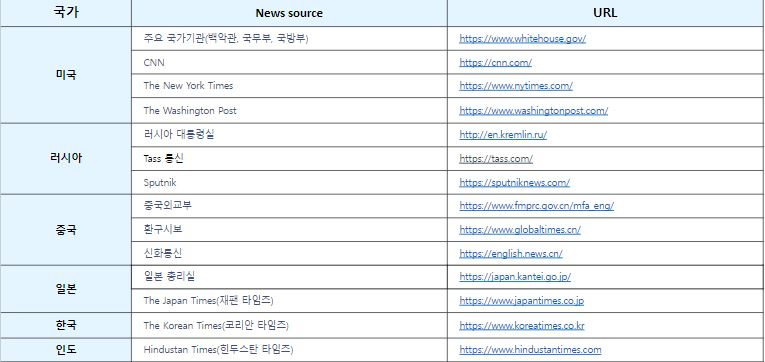

# Crawler
- Crawler 폴더는 Tacademy project의 일부입니다.
   국가간 관계를 분석하기 위한 자료들을 수집합니다.
- CNN, Newyorktimes, Wahsingtonpost, Hindustantimes의 크롤러는 twitter를 크롤링하는 twint를 통해서 만들었습니다.
- 이 폴더는 Airflow Pipeline으로 통합될 예정입니다.

# Data

- 15개의 Newssource의 자료를 크롤링 할 수 있는 크롤러가 있습니다.
- 크롤러는 "Newssource_scraper" 형태로 저장되어 있습니다.
  


# Folder structure

- 각 크롤러 폴더의 기본적인 구조는 다음과 같습니다. 다음의 구조는 koreantimes_scraper를 기초로 한 것입니다.
```
 koreantimes_scraper/
  │
  ├── searching_a_query.py - 크롤러를 실행하는 실행파일
  │
  ├── korean_scraper/
  │       ├── parser.py - 개별 기사의 url에서 제목, 내용, 저자 등을 부분을 받아오는 모듈
  │       ├── scraper.py - 개별 기사의 url을 받아오는 모듈
  │       ├── utils.py - 크롤러에 필요한 함수들이 있는 모듈
  │
  ├── output/ - 기사들의 결과물이 저장되는 폴더
  │
  ├── test.ipynb - 개별 크롤러의 모듈이 작동하는지 시험하는 노트북 파일  
```


# Usage

- 각 크롤러의 실행파일은 scraping_latest_news.py 입니다. 
- 폴더에서 python scraping_latest_news.py를 치면 크롤링 됩니다.
- 다음은 사용 예시입니다.
```
python scraping_latest_news.py


[1 / 10] (January 23, 2019) Temporary Protected Status and Immigration to the United States
[2 / 10] (January 22, 2019) How ‘Market Failure’ Arguments Lead to Misguided Policy
[3 / 10] (January 16, 2019) Do 40-Year-Old Facts Still Matter?: Long-Run Effects of Federal Oversight under the Voting Rights Act
[4 / 10] (January 15, 2019) Do Immigrants Import Terrorism?
[5 / 10] (January 15, 2019) The Myth of the Cyber Offense: The Case for Restraint
```
